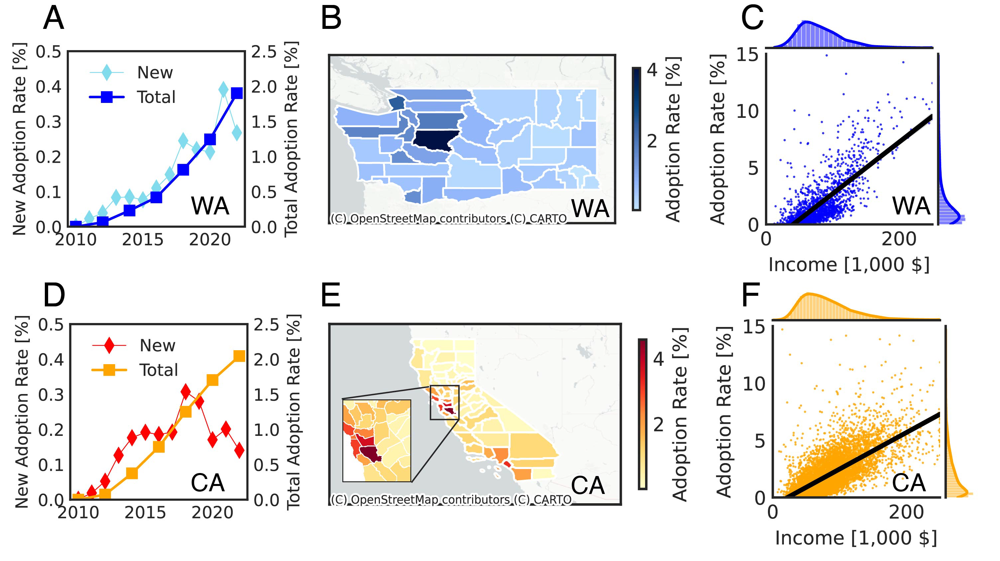

# Planning the Electric Vehicle Transition by Integrating Spatial Information and Social Networks

#### Jiaman Wu, Ariel Salgado and Marta C. Gonzalez

## Overview
The transition from gasoline-powered vehicles to plug-in electric vehicles (PEVs) presents a promising avenue for reducing greenhouse gas emissions. Spatial forecasts of PEV adoption are essential to facilitate this shift as they enable preparation for power grid adaptation. However, forecasting is hindered by the limited data availability at this early stage of adoption. Multiple model calibrations can match current adoption trends but yield divergent forecasts. By leveraging empirical data from places with leading adopters in the US, this study shows that taking into account the spatial and social structure linking potential PEV adopters leads to forecasts of only a third of the current predictions for 2050. Additionally, spatial social networks reproduce the temporal evolution of the empirical spatial auto-correlations over the last twelve years. At last, the study evaluates the potential impact of various PEV marketing campaigns under prevailing uncertainties, emphasizing the need to tailor strategies to network dynamics for effective PEV promotion.

<br/>
<br/>
<p align="center">
  
  <br><i> </i>
</p>

## Contents

[Overview](#Abstract)

[Dataset](#Dataset)

[Method](#Method)

[Setup](#Setup)

<h2 id="Abstract">Abstract</h2>
In this work, we investigate how spatial social networks influence PEV adoption forecasts by comparing benchmark adoption models at different spatial scales. We first aggregate individual purchase records at state, county, and census tract levels, and then we fit the empirical adoption trends at different levels of spatial aggregation in Washington and California. To that end, we consider two versions of the Bass model: the original BM and the Social Network BM (SocNet BM). We find that before 2022, PEV adoption was primarily driven by individual choices rather than social influences, a dynamic which cannot continue. As a result, both models can be calibrated to fit data up to 2022, but including or excluding social network effects leads to a threefold difference in projections by 2050. We observe that SocNet BM characterizes the temporal evolution of spatial auto-correlation better than the State/County BM. Also, with limited data, a combination of parameter sets of SocNet BM can fit the current adoption trend but lead to very different forecasts. At last, we point out that promotion campaigns should be designed based on the understanding of spatial social network structure in the area of interest as the effectiveness of campaigns is tied to the local socio-demographical structure. Altogether, the study offers insights on the forecast based on early adopters that is valuable to planning power grid demand and the allocation of charging infrastructure.


<h2 id="Dataset">Dataset</h2>
We use different datasets in this study: US Census Bureau American Community Survey, the California Plug-in Electric Vehicle Adopter Survey,  and Electric Vehicle Title and Registration Activity (EVTRA) data the Clean Vehicle Rebate Project (CVRP) data. 
<br/>
<br/>

|                         Name                         	| Geographical Coverage  	| Temporal Coverage 	| Geographical Resolution 	| Temporal Resolution 	|
|:----------------------------------------------------:	|:----------------------:	|:-----------------:	|:-----------------------:	|:-------------------:	|
|    [California Clean Vehicle<br>Rebate Project data](https://cleanvehiclerebate.org/en)   	|       California       	|     2010~2024     	|       Census Tract      	|         Day         	|
| [Electric Vehicle Title and <br>Registration Activity](https://data.wa.gov/Transportation/Electric-Vehicle-Title-and-Registration-Activity/rpr4-cgyd/about_data) 	|       Washington       	|     2010~2024     	|       Census Tract      	|         Day         	|
|      [Census Bureau American<br>Community Survey](https://data.census.gov/)      	|      United States     	|     2010~2023     	|       Census Tract      	|         Year        	|


Below is the overview of the dataset. (A,D) State-level yearly total adoption rate (circle marker) and new adoption rate (square marker) in Washington (blue) and California (orange) from 2010 to 2022. (B,E) Maps of county-level cumulative adoption rate in Washington (blue) and California (orange) in 2022. (C,F) Correlation between the adoption rate and the corresponding median household income of all census tracts in Washington (blue) and California (orange) in 2022. The regression line given the adoption rate and the corresponding median household income, as well as the 95% confidence interval for the regression, are shown with points.
<br/>
<br/>
<p align="center">
  
  <br><i> </i>
</p>


<h2 id="Method">Method</h2>

### Market Segmentation

We divide the potential market into three socio-demographic groups: low-income group (income below 33\% of the reference population of the state), middle-income group (income between 33\% and 66\% of the reference population of the state), and high-income group (income above 66\% of the reference population of the state). 

### Benchmark Bass Model

The Bass diffusion model enables us to investigate adoption dynamics [[1]]([https://cleanvehiclerebate.org/en](https://pubsonline.informs.org/doi/abs/10.1287/mnsc.15.5.215)). This can be done by fitting the cumulative distribution function of adoption data with the cumulative distribution function of the model. The Bass cumulative distribution function is defined by

$$\frac{dy(t)}{dt} = (p+q/m \times y(t))(m-y(t)),$$

where $y(t)$ is the number of adopters at time $t$, $p$ and $q$ parameter of adoption and $m$ is market size. This nonlinear differential equation can be solved by

$$y(t)=m\frac{1-e^{-(p+q)t}}{1+\frac{q}{p}e^{-(p+q)t}}.$$

### SocNet Bass Model

#### Social Network Construction

We construct social networks with ingredients of preferential attachment and distance selection by following [[2]](https://iopscience.iop.org/article/10.1209/epl/i2003-00600-6). (1) Selected at random a subset of $n_{0}$ initial active nodes. (2) Take an inactive node $i$ at random and connect it with an active node $j$ with probability (up to a normalization factor):

$$prob_{i\rightarrow j} \propto \frac{K(k_{j})}{D(d_{ij})},$$

where $k_{j}$ is the connectivity of node $j$, $d_{ij}$ is the distance in kilometers between nodes $i$ and $j$, and $K(.)$ and $D(.)$ are given functions. For each inactive node, we sample $k_r=3$ edges so that the average connectivity will be $\langle k \rangle = 2k_r$, and make the node $i$ active. Finally (3), go back to (2) until all nodes are active. To include preferential attachment and distance selection, we use $K(k) = k+1$ and $D(d) = d^{\gamma}$, where $\gamma=1,3,10$.

#### Simulation Procedure

This model consists of $n$ agents indexed by $i\in\{1,...,n\}$, each of which is in either of two states: potential adopter or adopter. We use a set of variables $v(t)$ to describe the agents’ adoption state (i.e.,  $v_{i}(t) = 1$ when agent $i$ has adopted at $t$). Analogously to the BM, the probability of agent $i$ to adopt depends linearly on an independent parameter $p$ and a parameter $q$ that depends on the fraction of prior adopted neighbors. Agent $i$’s probability to transition from non-adopter to adopter at $t$ is as follows:

$$f_{i}(t) = (p+\frac{\sum_{j\in z_{i}}v_{j}(t)}{|z_{i}|}q)(1-v_{i}(t)),$$
    
where $z_{i}$ is the set of agents having connections with node $i$. The formulation implies homogeneity and global interconnectedness, i.e., each agent’s probability of adoption is influenced uniformly by the adoption state of all other neighbor agents.  

#### Fitting Procedure

We follow the method in [[3]](https://www.nature.com/articles/s41598-020-72137-w). Without loss of generality, we take one county as an example to illustrate the procedure. The procedure consists of two stages: locating the initial point and searching for the optimal solution. 

<h2 id="Setup">Setup</h2>

### Installation
In order to install all the required files, create a virtual environment with `environment.yml` file.

```
conda env create -f environment.yml
```

### Implementation

This model is built up on [NetworkX](https://networkx.org/) and [Networkit](https://networkit.github.io/). Specifically, NetworkX is used on analysis and visualization. To speed up the calibration process, we follow the [framework](https://github.com/RichZhou1999/CE263-EV-Adoption-Diffusion-Model-) and implement network construction and fitting process with Networkit.

The structure of code:
- [NetworkPrep.py](model/NetworkPrep.py): Preprocess the adoption data and demographics data.
- [NetworkCreators.py](model/NetworkCreators.py): Create social network with ingredients of preferential attachment and distance selection.
- [NetworkParameter.py](model/NetworkParameter.py): Locate the initial guess of p and q through regression model.
- [SearchParameter.py](model/SearchParameter.py): Search optimal p and q around initial guess with heuristics. 
- [SearchParameter.py](model/SearchParameter.py): Simulate diffusion process with estimated p and q.


To run demo code for simulation and analysis:
- [RunState.py](model/RunState.py): Running adoption model calibration and simulation for Washington and California states.
- [RunCounty.py](model/RunCounty.py): Running adoption model calibration and simulation for a selected county.
- [CaseStudyLA.ipynb](model/CaseStudyLA.ipynb): Running case study in Los Angeles.
- [SupplementaryInfo.ipynb](model/SupplementaryInfo.ipynb): Running results for supplementary information.
- [VisDataFinal.py](analysis/VisDataFinal.py): Analysis and visualization of simulation results.

In order to run fitting and simualtion for all states, use the following command.

```
cd model
```

```
nohup python -u RunState.py > state_log.log &
```

